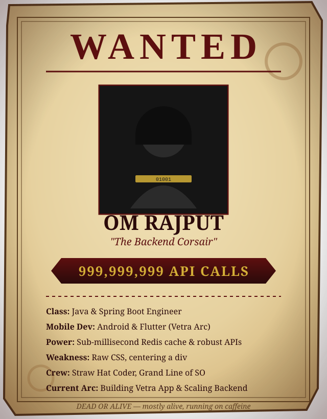

---

### Konichiwa

<table>
<tr>
<td width="60%" valign="top">

**Data Science student who accidentally fell in love with building real things.**

Frontend isn't my thing, but I still do it — the way a backend guy does frontend, which is to say the buttons work, nothing is centered, and every color choice was a cry for help.

Proof I can survive without a database, if forced at gunpoint: **[omrajput.me](https://omrajput.me)**

</td>
<td width="40%" align="center">

 me walking into standup after an all-nighter debugging prod
</td>
</tr>
</table>

---

### Hobbies (a.k.a. what happens when the build finally passes)

- Gaming addict — competitive in everything except my sleep schedule
- Watching anime — One Piece, Vinland Saga, Chainsaw Man, Berserk on repeat
- Reading manga faster than I read documentation
- Badminton — neighbourhood champion, undefeated, no witnesses

 my aura when someone says "it works on my machine"

---

### Languages & Tools

**Languages**

**Backend**

**Databases**

**Frontend** — *dabbled in it, not a pro, mostly held together by hope*

**Tools**

> *"CSS is my Kaido — I've fought it a hundred times and I'm still one-shot every time."*

 the exact moment a query stops taking 8 seconds

---

### Currently Grinding (Currently Learning)

Training arc status: grinding LeetCode like it owes me XP
  

 Thorfinn training arc, but it's me and LeetCode

---

### Stats from the Battlefield

---

### Contact Me

Reach out if you want to talk backend, debug a system together, argue about anime power scaling, or just game — no doubt too small, no hangout request refused.

 "I have no enemies" — me, opening your pull request

 thanks for scrolling this far, here's Denji as a reward
  

"Power is justice, that's how this world works." — my commit history is my proof

